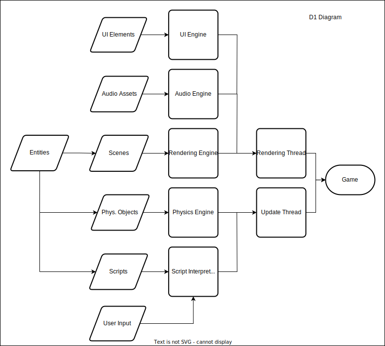

# Chrus Engine Overview
## Team and Project Abstract
Team Name: Team Chrus

Team Members:
- Chris Lee, Computer Science, lee4cr@mail.uc.edu

Project Advisor:
- Dr. Badri Vellambi

## [Project Description](essays/project-description.md)

## User Stories and Design Diagrams
[User Stories](essays/user-stories.md)

### D0 Diagram

### D1 Diagram

### D2 Diagram

## Project Tasks and Timeline
The task list can be found [here](essays/task-list.md).

### Timeline and Effort Matrix

## [Constraint Essay](essays/constraint-essay.md)
## [Professional Biography](essays/professional-biography.md)
## Budget
No expenses so far.

## Appendix
N/A
