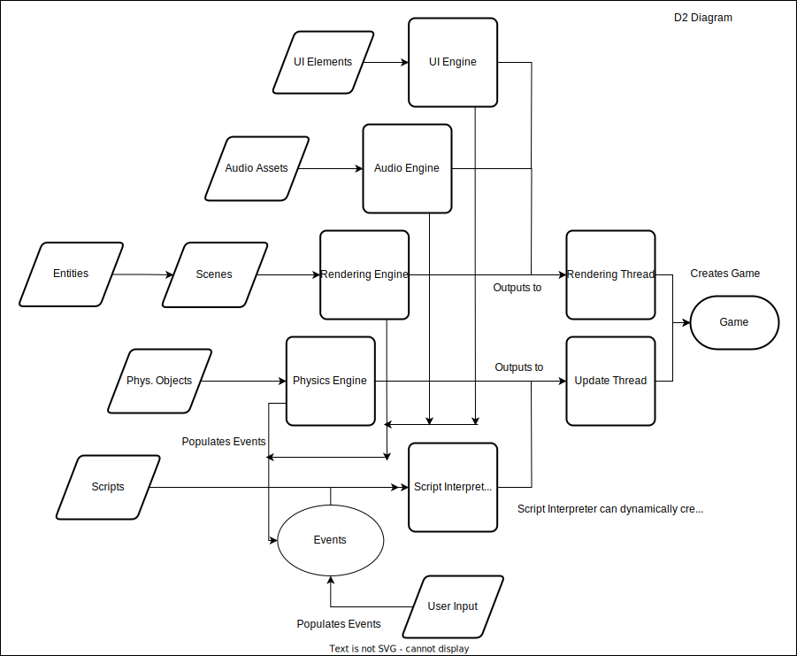

# Chrus Engine

## Table of Contents

* [Chrus Engine](#chrus-engine)
    * [Table of Contents](#table-of-contents)
    * [Team Information](#team-information)
    * [Project Description](#project-description)
        * [Project Abstract](#project-abstract)
    * [User Stories and Design Diagrams](#user-stories-and-design-diagrams)
        * [User Stories](#user-stories)
        * [Design Diagrams](#design-diagrams)
    * [Project Tasks and Timeline](#project-tasks-and-timeline)
        * [Task List](#task-list)
        * [Timeline and Effort Matrix](#timeline-and-effort-matrix)
    * [Project Constraints](#project-constraints)
    * [PowerPoint Slide Deck](#powerpoint-slide-deck)
    * [Capstone Assessment](#capstone-assessment)
    * [Professional Biography](#professional-biography)
    * [Budget](#budget)
    * [Appendix](#appendix)
        * [Hours of Effort](#hours-of-effort)

## [Team Information](./project-description.md)

### Team Name: Team Chrus

### Team Members

- **Chris Lee**
    - Major: Computer Science
    - Email: lee4cr@mail.uc.edu

### Project Advisor

- **Dr. Badri Vellambi**
    - Email: vellambn@mail.uc.edu

## [Project Description](./project-description.md)

### Project Abstract

Chrus Engine is a game engine intended for the development of lightweight, cross-platform, and performant 2D games. For this, Chrus Engine provides abstractions for necessary systems such as rendering, user interfaces, audio, and scripting. In addition, this project aims to create video game(s) to demonstrate the features of the engine.

### Inadequacy of Current Solutions to Problem

Most current game engines do not have the combination of being free and open source, performant, and dedicated to 2D rendering. A free and open source engine will enable developers to create modifications to the engine as necessary for their games, which engines like Unity and GameMaker don't offer. Being performant will enable developers to utilize efficient graphics and a fast interpreter to create more intensive games.

### Technical Background

I have experience with writing desktop applications in C.

## User Stories and Design Diagrams

### [User Stories](./user-stories.md)

1. As a developer, I want to spend less time working on low-level systems so that I can focus my time on developing a game.
2. As a modder, I want game scripts and assets to be easily modifiable so that I can create custom content for games.
3. As a distributor, I want the engine to have compatibility with multiple platforms, so that games have larger reach.
4. As a player, I expect stability from the engine, so that games running this engine run smoothly and without bugs.

### Design Diagrams

#### Detail Level 0

#### Detail Level 1

#### Detail Level 2

## Project Tasks and Timeline

### [Task List](./task-list.md)

- [ ] Specify desired list of features for game engine
- [x] Specify programming language used to develop engine
- [x] Research options for potential game script interpreter
- [x] Investigate potential multimedia libraries
- [x] Investigate potential languages for game engine
- [x] Investigate potential scripting languages for game engine
- [ ] Design UI engine
- [ ] Design audio engine
- [ ] Design rendering engine
- [ ] Develop UI engine
- [ ] Develop audio engine
- [ ] Develop rendering engine
- [ ] Develop script interpreter
- [ ] Design videogame(s) to test features
- [ ] Develop videogame(s) to test features
- [ ] Test engine features for correct behavior
- [ ] Test games for correct behavior
- [ ] Refactor games and engine code

### [Timeline and Effort Matrix](./timeline-and-effort-matrix.pdf)

See header link for timeline and effort matrix.

## [Project Constraints](./constraint-essay.md)

In terms of constraints, there are only a few that affect my project, which is the design and development of a game engine and video game using said engine. However, I still need to consider the economic, professional, and time constraints that my project will have.

Firstly, the economic constraints on my project will probably be the largest of the constraints. Since the senior design class has a very short timespan to design and develop a project that is as large as mine, I need to rely on libraries written by other people to handle the implementation of functions that would be outside the scope of my project. I plan on only using free and open source libraries, so there are a small selection of libraries that I can use to abstract the usage of computer graphics.

Professional constraints are another concern I have with my project. Although I technically have professional experience with game development, I have no real experience with game engine development or even systems programming. This project would be a massive boost to my professional development, so my standards are especially high for this project. In terms of needed expertise, any game developed as demos for the presentation will likely require others' art expertise and/or assets.

Lastly, time is an important constraint for this project. The scope of this project are carefully selected such that the workload for this project is much smaller than writing a game engine from scratch, but the development of a game engine is still a very large task, as the vast majority of the labor for this project will be for absolutely necessary systems such as rendering and the script interpreter.

## [PowerPoint Slide Deck](https://mailuc-my.sharepoint.com/:p:/g/personal/lee4cr_mail_uc_edu/EQAowPYdaENLhlbckKBLG9UBLMLtr9eiA54ZuGQCJKSWJA?e=jcx9Zv)

The slide deck is accessible through the header hyperlink.

## [Capstone Assessment](./capstone-assessment.md)

My senior design project is about taking all of the skills that I've picked up from my classes and my co-op experiences and putting them into a project that I'm truly passionate about. Even though I've never had the opportunity to create or to work on a game engine in my classes and co-ops, I want to prove that what I've learned from my classes and my co-op experiences can be transferred into making my passion projects real.

A few classes that I think gave me some helpful skills for writing a game engine were Data Structures and Algorithms, and Software Engineering. In Data Structures and Algorithms, I learned a lot about algorithmic complexity and a little bit about how to write faster algorithms. Because video games typically need to render between 30 to 60 times a second or even higher, it's absolutely necessary for me to use faster algorithms and write optimized code. In Software Engineering, I learned a lot about the potential pitfalls that a lot of projects face, especially the larger that they scale, and I'm going to try to use that knowledge to hopefully have a smoother design and implementation process.

Even though I've never had the opportunity to do game development for any of my co-op experiences, I still feel that some of my co-ops gave me the opportunity to learn some skills that I think will help me a lot for my senior design project. At my first co-op with The Modal Shop, my position as a software developer gave me the chance to do application development with C. Being able to both learn and use C gave me a lot of experience with a language that could be used for engine development as well as important concepts like manually managing memory. Memory management is especially important for video games since they can easily become memory-intensive.

I can't wait to start on this project, because making video games has always been one of my passion projects. It's the reason why I decided to study computer science (although I like computer science for other reasons now) starting in high school. In fact, my first experiences with programming came from learning how to write scripts for sandbox games like modded Minecraft. When I get started on making my game engine, I want to start approaching the issue by finding a library that'll help me with the low-level aspects of multimedia applications and looking at simpler videogames for inspiration. Starting with coding my own multimedia library is already in the scope of a senior design project itself, so I really think that coding from "scratch" would just be too big of a scope. Since I'm not sure about how systems in a video game integrate with each other, I'm curious to see how other people have approached it before.

When I finish my game engine, I hope to have an engine that I can easily reuse for different genres of videogames. I've already set a limitation for myself though, that I would focus on either 2D or 3D graphics specifically, and not both. I don't expect to have anything that competes with modern engines, but I hope that with an independently developed engine, I could use it for myself and create videogames that can be distributed cross-platform on major distribution platforms like Steam. I know I'll be done with my engine when I can make functioning games with it, and I'll know if I did a good job or not if I don't regret using the engine to make my own games with it.

## [Professional Biography](./professional-biography.md)

### Chris Lee

- Email: lee4cr@mail.uc.edu
- Phone: (513) 500-4706

### Work Experience
**Software Engineering Co-op**, *Matson Money*
* Developed a script in Python to automatically download, parse, and store data downloaded from the SEC
* Created a utility library in Python to automatically transfer and re-map PDF form fields between PDF files
* Maintained database records using SQL queries to update data

**Computer Engineering Co-op**, *Chamberlain Group*
* Developed an Android application to interface with an IoT device
* Collaborated with UI/UX to implement Android application's front-end
* Prototyped features for consumer electronics including speech and gesture recognition
* Worked with firmware and sensors to prototype an IoT device to communicate with Android app

**Software Developer Co-op**, *The Modal Shop*
* Designed and implemented a database in SQL Server
* Parsed unstructured datasets totaling ~100k files using Python
* Developed front-end application with Access VBA to view records
* Updated applications written in C with LabWindows CVI framework
* Rewrote an application's back-end to use ODBC instead of closed source library for UTF-8 compatibility
* Implemented a server in Python to query local weather conditions from instruments and display graphed data on a website
* Maintained macros written in VBA for spreadsheets made for customer use

## Budget

There have been no monetary expenses so far, and none are planned for the remaining duration of this project.

## Appendix

### Hours of Effort

As of 26 November 2023, the following list approximates the work done so far on the project:

- Investigate potential multimedia libraries (~3 hours)
    - Using Allegro 5
- Investigate potential languages for game engine (~3 hours)
    - Looked at C, C++, and Rust.
- Investigate potential scripting languages for game engine (~3 hours)
    - Looked at Lua, Perl, and Python.
- Specify programming language used to develop engine (~3 hours)
    - Using C programming language.
- Research options for potential game script interpreter (~3 hours)
    - Using LuaJIT.
- Design UI engine (~10 hours)
- Design rendering engine (~10 hours)
- Work on CS5001 Assignments (~10 hours)